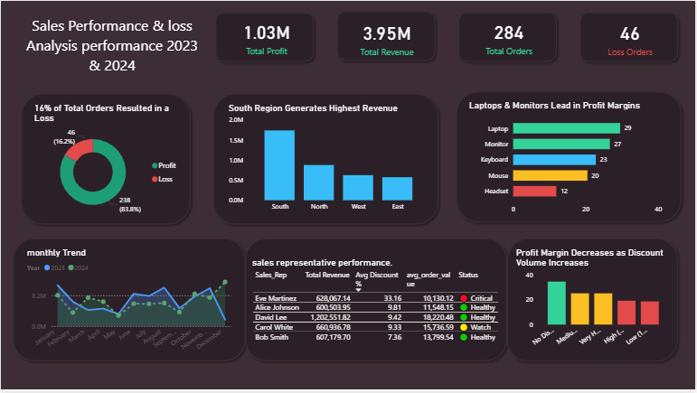

# Sales Performance & Loss Analysis — 2023–2024

> An end-to-end data analytics project investigating a 16.2% loss order rate across 284 sales transactions using MySQL for data cleaning and KPI analysis, and Power BI for interactive visualization.



---

## Table of Contents

- [Business Problem](#business-problem)
- [Project Objectives](#project-objectives)
- [Dataset Overview](#dataset-overview)
- [Data Quality Issues](#data-quality-issues)
- [Cleaning Approach](#cleaning-approach)
- [Key Findings](#key-findings)
- [Recommendations](#recommendations)
- [Tools Used](#tools-used)
- [Repository Structure](#repository-structure)
- [What I Learned](#what-i-learned)

---

## Business Problem

The company is experiencing an unsustainable loss order rate of **16.2%** — meaning nearly 1 in 5 orders generates negative profit. Despite $3.95M in total revenue the business retains only 26 cents of every dollar earned, with 46 orders actively destroying value.

Management needs to understand where these losses are concentrated and what is driving them in order to take corrective action. This project investigates three dimensions — regional performance, product profitability, and sales rep behavior — to identify the root causes and quantify their impact.

---

## Project Objectives

- Clean and standardize a raw sales dataset containing multiple real-world data quality issues
- Identify the root causes of a 16.2% loss order rate across region, product, and sales rep dimensions
- Analyze the relationship between discount levels and profit margin
- Quantify the financial impact of each loss driver
- Build an interactive dashboard to communicate findings clearly to a business audience

---

## Dataset Overview

| Attribute | Detail |
|---|---|
| Source | Synthetically generated to simulate real-world sales data quality issues |
| Raw rows | 315 |
| Cleaned rows | 284 (after deduplication) |
| Columns | 13 |
| Period | January 2023 — December 2024 |
| Regions | North, South, East, West |
| Products | Laptop, Monitor, Keyboard, Mouse, Headset |
| Sales Reps | 5 named reps + 18 unidentified orders |

> The dataset was intentionally generated with hidden story patterns — a structurally unprofitable region, a margin-negative product, and an outlier sales rep — to simulate the kind of real-world analytical challenge a data analyst would face.

---

## Data Quality Issues

The following issues were identified in the raw dataset before cleaning:

| Issue | Description | Column(s) Affected |
|---|---|---|
| Missing values | Nulls and empty strings scattered across multiple columns | Order_ID, Order_Date, Region, Sales_Rep, Product, Channel, Quantity, Unit_Price, Discount_% |
| Duplicate rows | ~15 fully duplicated rows injected randomly | All columns |
| Inconsistent casing | Same values in mixed cases e.g. "north", "SOUTH", "East" | Region, Product, Sales_Rep, Channel |
| Trailing spaces | Leading and trailing whitespace in text fields | Region, Sales_Rep |
| Mixed date formats | Dates stored in 4 different formats simultaneously | Order_Date |
| Negative prices | Some Unit_Price values were negative — data entry errors | Unit_Price |
| Invalid discounts | Some Discount_% values exceeded 1.0 — above 100% | Discount_% |
| Revenue outliers | Some Revenue values inflated 1000x | Revenue |
| Invalid ratings | Customer_Rating values of 0, 6, or 99 — outside valid range | Customer_Rating |
| Negative costs | Some Cost values were negative — data entry errors | Cost |

---

## Cleaning Approach

All cleaning was performed in MySQL using a structured pipeline. The clean table was always produced fresh using TRUNCATE before re-running INSERT scripts to avoid data multiplication.

**Step 1 — Deduplication**
Duplicate rows were identified and removed using ROW_NUMBER() with PARTITION BY across all key columns. Only the first occurrence of each duplicate group was retained.

**Step 2 — Text Standardization**
Region, Product, Channel, and Sales_Rep columns were standardized using TRIM, LOWER, and CASE statements. Both NULL values and empty strings were handled explicitly — a key MySQL-specific requirement where empty strings do not match IS NULL checks. An ELSE 'Unknown' clause was added to all CASE statements as a safety net for unanticipated values.

**Step 3 — Date Standardization**
Order_Date contained four mixed formats. REGEXP was used to detect each pattern and STR_TO_DATE with the matching format string parsed each into a unified YYYY-MM-DD format. Unparseable dates were set to NULL.

**Step 4 — Invalid Value Correction**
- Negative Unit_Price values corrected using ABS()
- Negative Cost values corrected using ABS()
- Discount values above 1.0 (above 100%) set to NULL as mathematically invalid — no business cap was applied to remaining values as no policy rule existed to justify one
- Customer_Rating values outside the 1.0–5.0 range set to NULL

**Step 5 — Derived Column Recalculation**
Revenue and Profit were recalculated from cleaned values rather than trusted from the raw data, ensuring internal consistency across all financial columns.

**Step 6 — Order Status Flag**
A new column order_status was added classifying each order as 'Profit' or 'Loss' based on the cleaned Profit value. Negative profit orders were retained rather than removed — selling at a loss is a valid business scenario and the pattern itself became the central analytical finding.

**Key Decisions Documented:**
- 18 orders with missing Order_ID were labeled 'UNKNOWN' and retained — the remaining transaction data was valid for revenue and product analysis but these rows were excluded from sales rep performance conclusions
- Negative profit orders were retained and flagged rather than dropped — this decision surfaced the project's core business insight
- No discount cap was applied beyond removing mathematically invalid values — business rules should determine caps, not analyst assumptions

---

## Key Findings

### Overall Performance

| Metric | Value |
|---|---|
| Total Revenue | $3,948,488 |
| Total Profit | $1,025,265 |
| Overall Profit Margin | 25.96% |
| Total Orders | 284 |
| Loss Orders | 46 |
| Loss Rate | 16.2% |
| Average Order Value | $13,903 |

Despite $3.95M in revenue the business retains only 26 cents of every dollar earned, with 46 loss-making orders actively destroying value.

---

### Finding 1 — Regional Performance

| Region | Orders | Revenue | Profit Margin | Loss Rate | Avg Discount |
|---|---|---|---|---|---|
| South | 108 | $1,739,476 | 6.47% | 32.41% | 14.02% |
| North | 62 | $876,936 | 39.98% | 9.68% | 14.32% |
| West | 53 | $624,961 | 40.87% | 5.66% | 14.34% |
| East | 53 | $573,077 | 43.51% | 3.77% | 14.34% |

The South region processes the highest order volume at 108 orders yet achieves only a **6.47% profit margin** — compared to 40–43% in all other regions. Critically, average discount rates are nearly identical across all regions at approximately 14%, confirming that South's underperformance is driven by **structural cost issues rather than discounting behavior**. This is a regional operations problem, not a sales behavior problem.

---

### Finding 2 — Product Performance

| Product | Orders | Revenue | Profit Margin | Loss Rate | Avg Discount |
|---|---|---|---|---|---|
| Laptop | 65 | $1,202,586 | 29.48% | 9.23% | 12.37% |
| Monitor | 62 | $1,008,015 | 26.67% | 11.29% | 15.45% |
| Keyboard | 63 | $951,101 | 22.79% | 17.46% | 14.14% |
| Mouse | 43 | $615,318 | 20.49% | 17.65% | 13.71% |
| Headset | 56 | $65,999 | 11.90% | 28.57% | 16.25% |

Headset is the least profitable product with an **11.9% margin and 28.57% loss rate** — nearly 3x the loss rate of Laptops. Despite generating the lowest revenue at $66K it contributes disproportionately to overall losses. Its above-average discount rate of 16.25% compounds already thin margins, making any discounted Headset order highly likely to result in a loss.

Laptops are the standout performer — highest revenue at $1.2M, highest profit at $354K, lowest loss rate at 9.23%, and lowest average discount at 12.37%. This confirms that disciplined pricing directly drives profitability.

---

### Finding 3 — Sales Rep Performance

| Sales Rep | Orders | Revenue | Profit | Avg Discount | Loss Rate | Avg Rating |
|---|---|---|---|---|---|---|
| David Lee | 66 | $1,202,552 | $394,990 | 9% | 6.06% | 3.98 |
| Bob Smith | 44 | $607,180 | $199,334 | 7% | 4.55% | 4.00 |
| Carol White | 42 | $660,937 | $192,731 | 9% | 7.14% | 4.02 |
| Alice Johnson | 52 | $600,504 | $166,456 | 10% | 9.62% | 4.00 |
| Eve Martinez | 62 | $628,067 | $9,552 | 33% | 48.39% | 3.20 |
| Unknown | 18 | $249,249 | $62,202 | 9% | 11.11% | 4.02 |

Eve Martinez is a critical outlier. Despite generating $628K in revenue — comparable to Bob Smith's $607K — she produces only **$9,552 in profit** versus Bob's $199,334. The sole differentiator is average discount: Eve at 33% versus Bob at 7%. Nearly **1 in 2 of Eve's orders results in a loss**, and her customer satisfaction rating of 3.2 is the lowest on the team — confirming that aggressive discounting is neither retaining customers nor generating profit.

David Lee is the benchmark performer — highest revenue at $1.2M, highest profit at $395K, second lowest discount at 9%, and lowest loss rate at 6.06%. High volume and disciplined pricing are not mutually exclusive.

> 18 orders with unidentified sales reps were excluded from rep-level analysis but retained in overall revenue and regional calculations.

---

### Finding 4 — Discount Impact Analysis

| Discount Bucket | Orders | Avg Profit | Avg Revenue | Profit Margin | Loss Orders |
|---|---|---|---|---|---|
| No Discount | 22 | $7,382 | $21,372 | 34.54% | 0 |
| Low 1–10% | 106 | $4,629 | $13,590 | 34.06% | 1 |
| Medium 11–20% | 97 | $4,024 | $15,414 | 26.10% | 15 |
| High 21–30% | 15 | $275 | $12,400 | 2.22% | 5 |
| Very High 31–45% | 44 | -$505 | $8,104 | -6.23% | 25 |

The discount impact analysis reveals a clear and severe relationship between discount level and profitability. Orders with no discount achieve a **34.54% profit margin and generate zero losses**. This margin holds steady for low discounts of 1–10% at 34.06% — suggesting small discounts have minimal impact.

However above 20% discount the margin collapses dramatically — from 26.10% in the medium bracket to just 2.22% at high discounts and a deeply **negative -6.23% in the very high bracket of 31–45%**. Orders in the very high discount bracket have a **56.8% loss rate** — more than half result in a loss.

The critical threshold is **21%** — any discount above this level represents an unacceptable profitability risk. Discounts above 20% account for **25 of 46 total loss orders — 54% of all losses** — despite representing only 59 of 284 total orders — just 20% of transactions.

---

### Finding 5 — Monthly Revenue Trend

Revenue shows a general upward trajectory from 2023 to 2024 with 2024 outperforming 2023 across most months. However the positive revenue trend is undermined by the persistent loss order rate — revenue growth without margin improvement does not translate to sustainable profitability.

---

### The Three Root Causes — Summary

| # | Root Cause | Key Evidence |
|---|---|---|
| 1 | South region structural cost problem | 6.47% margin vs 40–43% elsewhere despite identical 14% discount rate |
| 2 | Headset product margin pressure | 11.9% margin, 28.57% loss rate, lowest revenue at $66K |
| 3 | Eve Martinez discounting behavior | 33% avg discount, 48.39% loss rate, $9,552 profit on $628K revenue |

---

## Recommendations

**Recommendation 1 — South Region**
Commission a cost audit of South region operations. The 6.47% margin despite normal discount levels indicates a structural pricing or supplier cost problem unrelated to rep behavior. Implement a minimum margin threshold of 20% for all Southern sales until the root cause is identified and resolved.

**Recommendation 2 — Headset Product**
Implement a no-discount policy on Headsets immediately. Review supplier costs and consider a price increase. If margins cannot be improved above 20% within two quarters consider discontinuing or repositioning the product. At 11.9% margin even a small discount guarantees a loss.

**Recommendation 3 — Discount Policy**
Implement an immediate discount cap of 20% across all sales reps and all products. Any discount above this threshold requires written management approval with a margin justification. This single policy change would directly address the Very High discount bucket which accounts for 25 of the 46 total loss orders — eliminating 54% of all losses in one intervention. Provide Eve Martinez with targeted coaching on margin-aware selling and set a 90-day improvement target.

> Addressing all three root causes simultaneously could realistically reduce the loss order rate from 16.2% to below 8% — effectively doubling the profit retained on existing revenue without acquiring a single new customer.

---

## Tools Used

| Tool | Purpose |
|---|---|
| MySQL | Data cleaning, transformation, and KPI analysis |
| Power BI Desktop | Interactive dashboard and data visualization |
| GitHub | Version control and portfolio hosting |

---

## Repository Structure

```
sales-performance-analysis/
│
├── data/
│   └── sales_data_raw_v2.csv          — Raw messy dataset (315 rows)
│
├── sql/
│   ├── 01_cleaning_query.sql          — Full data cleaning pipeline
│   └── 02_kpi_queries.sql             — All KPI analysis queries
│
├── dashboard/
│   ├── sales_dashboard.pbix           — Power BI dashboard file
│   └── dashboard_screenshot.png       — Dashboard preview image
│
└── README.md                          — This file
```

---

## What I Learned

This project taught me that data cleaning is not just a technical step — it is an analytical one. Every decision about what to fix, what to flag, and what to keep requires business judgment, not just code. The most important lesson was that negative profit orders should never be dropped blindly — retaining them and investigating their pattern revealed the entire story of this project.

I also learned that real findings often contradict initial assumptions. I expected Eve Martinez's discounting to explain South's losses — but the data showed that South's discount rate was identical to every other region, pointing to a deeper structural problem. Letting the data challenge the hypothesis rather than confirming it produced a more credible and nuanced analysis.

Finally, the discount impact analysis showed me the power of bucketing continuous variables — transforming raw discount percentages into five meaningful categories made a complex relationship instantly visible and actionable.

---

*This project is part of a two-project data analytics portfolio. 
The second project covers RFM (Recency, Frequency, Monetary) 
customer segmentation analysis targeting business and 
marketing analyst roles.*
